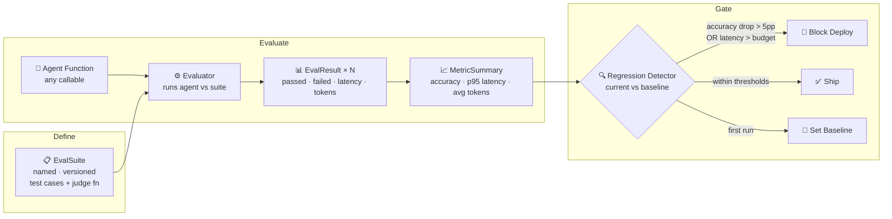

# agent-eval-framework


Production-grade evaluation framework for LLM agents — accuracy measurement, regression detection, and continuous quality signals.

Most agent eval tools are built for research benchmarks. This library is built for production: run evals on every agent update, catch regressions before they ship, and give teams the signal they need to decide whether a new model or prompt change is safe to deploy.

---

## The Problem → Solution → Impact

| | |
|---|---|
| **Problem** | Teams ship agent updates (new model, new prompt, new tools) with no systematic way to know if the agent got better or worse. Silent regressions reach users. |
| **Solution** | A continuous evaluation loop: define test cases once, run them on every agent update, compare against baseline, and block deploys when quality drops. |
| **Impact** | Catch regressions before they ship. Give every agent a quality score. Build confidence to iterate fast without breaking production. |

---

## System Design



---

## Layer Breakdown

| Layer | Component | What It Does |
|-------|-----------|-------------|
| **Definition** | `EvalSuite` | Named, versioned collection of test cases with a pluggable judge function |
| **Execution** | `Evaluator` | Runs any callable agent against a suite, captures pass/fail + latency per case |
| **Measurement** | `MetricSummary` | Accuracy, p50/p95 latency, token usage across all cases |
| **Gating** | `RegressionDetector` | Compares current run to baseline; blocks when quality drops below threshold |
| **Quality Signal** | `EvalResult` | Per-case output: expected vs actual, pass/fail, latency, error details |
| **Self-improvement** | `LearningLoop` | Accumulate corrections → validate across N runs → promote to classifier |

---

## Regression Detection in Action

```
Agent v1 (baseline):   Accuracy: 94.0% | p95: 380ms  → ✅ Ship
Agent v2 (new prompt): Accuracy: 96.0% | p95: 290ms  → ✅ Ship (improvement)
Agent v3 (new model):  Accuracy: 81.0% | p95: 420ms  → 🚫 BLOCK
                       Accuracy dropped 13.0% (threshold: 5.0%)
```

## The Problem

Three things go wrong when teams skip structured agent evaluation:

1. **Silent regressions** — a prompt change improves one task but breaks three others; no one notices until users complain
2. **No baseline** — teams can't answer "is this agent better or worse than last week?"
3. **Manual spot-checks** — engineers eyeball outputs instead of running systematic measurement

This framework addresses all three.

## How It Works

```
Define EvalSuite            Run Evaluator           Check Regression
(cases + judge fn)    →    (agent vs suite)    →    (current vs baseline)
       │                         │                         │
  EvalCase × N             EvalResult × N           RegressionReport
  expected output          passed/failed             block or ship
  risk tags                latency per case
```

## Quick Start

```python
from src.suite import EvalSuite, EvalCase
from src.evaluator import Evaluator
from src.regression import RegressionDetector

# 1. Define your eval suite
suite = EvalSuite(name="triage-agent", version="1.0")
suite.add_case(EvalCase("c1", {"incident": "Service is down"}, "sev1"))
suite.add_case(EvalCase("c2", {"incident": "High latency observed"}, "sev2"))
suite.add_case(EvalCase("c3", {"incident": "Minor config drift"}, "sev3"))

# 2. Run your agent against it
evaluator = Evaluator()
results, summary = evaluator.run(my_agent, suite)
print(summary)
# Accuracy: 100.0% (3/3) | Latency p50=120ms p95=180ms | Avg tokens: 245

# 3. Detect regressions before shipping
detector = RegressionDetector(accuracy_drop_threshold=0.05)
report = detector.check("triage-agent", summary)
if report.has_regression:
    raise RuntimeError(f"Regression detected: {report}")
```

## Key Components

### EvalSuite

A named, versioned collection of test cases with a judge function:

```python
suite = EvalSuite(
    name="my-agent",
    version="2.1",
    # Default: exact match. Override with semantic or LLM-as-judge:
    judge=lambda expected, actual: expected.lower() in actual.lower()
)
```

### Evaluator

Runs any callable agent against a suite. Agents are plain Python functions — no SDK lock-in:

```python
def my_agent(query: str, context: str) -> str:
    # call your LLM here
    ...

results, summary = evaluator.run(my_agent, suite)
```

Captures: accuracy, per-case pass/fail, latency (ms), error details.

### RegressionDetector

Compares a new eval run to a stored baseline. Configurable thresholds:

```python
detector = RegressionDetector(
    accuracy_drop_threshold=0.05,   # block if accuracy drops >5pp
    latency_budget_ms=2000,         # block if p95 latency >2s
)
```

On first run, the result becomes the baseline automatically.

### MetricSummary

```
Accuracy: 94.0% (47/50) | Latency p50=120ms p95=380ms | Avg tokens: 312
```

## The Learning Loop — agents that improve without retraining

The hardest problem in production agent systems: **the agent gets something wrong, you correct it, but the correction lives in your head.** The next session starts fresh.

The `LearningLoop` solves this with a three-stage pipeline:

```python
from src.learning_loop import LearningLoop

loop = LearningLoop(min_confirmations=3, min_confidence=0.75)

# Stage 1: CANDIDATE — observed once, don't promote yet
loop.observe(
    pattern_id="timeout-classification",
    description="Agent classifies database timeouts as 'unknown error'",
    correction="Connections to port 5432 timing out → classify as 'infrastructure/database'",
    example_case="triage-case-44",
)

# Same error occurs in subsequent eval runs
loop.confirm("timeout-classification")  # run 2
loop.confirm("timeout-classification")  # run 3
loop.confirm("timeout-classification")  # run 4 — now CONFIRMED (>= 3 confirmations, >= 75% confidence)

# Stage 3: PROMOTED — export to agent context
loop.promote("timeout-classification")
print(loop.export_promoted())
# ## timeout-classification
# Problem: Agent classifies database timeouts as 'unknown error'
# Correction: Connections to port 5432 timing out → classify as 'infrastructure/database'
# Confidence: 100% (3 confirmations)
```

**Why three stages instead of immediate promotion:**

A single eval run can produce false corrections — edge cases, mislabeled test data, or model variance. Promoting a one-off correction as a permanent rule degrades the agent for the common case.

The three-stage model requires a pattern to appear in at least `min_confirmations` independent eval runs before it can be promoted. If later evidence contradicts it (rejection count > confirmation count), it moves to REJECTED and is excluded from future promotions.

**Connecting to the deployment pipeline:**

```python
# After every eval run
results, summary = evaluator.run(agent, suite)
report = detector.check(suite.name, summary)

if report.has_regression:
    # Record what went wrong
    for case in results:
        if not case.passed:
            loop.observe(f"failure-{case.case_id}", case.input, case.actual_output)
    sys.exit(1)  # block deploy

# Promote confirmed patterns and inject into next agent version
ready = loop.ready_to_promote()
for entry in ready:
    loop.promote(entry.pattern_id)
knowledge_update = loop.export_promoted()
# → write to agent's system prompt or knowledge base
```

---

## Project Structure

```
agent-eval-framework/
├── src/
│   ├── suite.py          # EvalSuite, EvalCase, SuiteRegistry
│   ├── evaluator.py      # Runs agent vs suite, collects EvalResult per case
│   ├── metrics.py        # MetricSummary, compute_summary
│   ├── regression.py     # RegressionDetector, RegressionReport
│   └── learning_loop.py  # LearningLoop: accumulate → validate → promote
├── tests/
│   ├── test_evaluator.py      # 4 tests: pass, partial, exception, latency
│   ├── test_regression.py     # 5 tests: baseline, regression, latency, improvement
│   └── test_learning_loop.py  # 12 tests: stages, promotion, rejection, confidence, export
└── examples/
    └── basic_eval.py   # Triage agent with regression simulation
```

## Running Tests

```bash
pip install pytest
pytest tests/ -v
```

## Design Decisions & Trade-offs

### 1. Three-stage learning vs immediate promotion

Immediate promotion (observe → promote) is simpler but dangerous in production. A single eval run can produce false corrections:
- Test data that was mislabeled
- Model variance on a specific input
- An edge case that conflicts with the common case

The three-stage model requires `min_confirmations` independent observations before promotion. **The cost:** slower to benefit from corrections. **The benefit:** every promoted rule has evidence behind it, not just a single session's data.

**The minimum confirmation count (default: 3) should scale with your eval cadence.** If you run evals daily, 3 confirmations = 3 days before promotion. If you run on every PR, 3 confirmations might happen in a day. Set it based on how quickly you want to respond vs how much false-promotion risk you're willing to accept.

---

### 2. Confidence score: confirmations / (confirmations + rejections)

The confidence score is a simple ratio, not a Bayesian update or weighted average. This is intentional:

- **Simple to reason about:** 3 confirms + 1 reject = 75% confidence. Everyone on the team understands this.
- **Rejection matters:** A pattern confirmed 100 times with 100 rejections has 50% confidence — correctly flagged as uncertain.
- **No decay:** Older observations count the same as recent ones. If you need recency weighting, add a timestamp and decay old votes before computing confidence.

---

### 3. Export format: Markdown for agent injection

`export_promoted()` produces a Markdown document, not JSON or a structured type. This is because the most common use is injecting the learned corrections into an agent's system prompt or knowledge base — both of which are text.

If your architecture uses structured tool responses (e.g., RAG that returns JSON), format the output differently in your application layer. The core data is on the `LearningEntry` objects directly.

## Integrating Into CI/CD

Add an eval step to your deployment pipeline:

```python
# In your CI pipeline — runs before every agent deployment
results, summary = evaluator.run(new_agent_version, suite)
report = detector.check(suite.name, summary)
if report.has_regression:
    # Block the deployment
    sys.exit(1)
```

## Extending the Judge

The default judge uses exact string match. For open-ended tasks, plug in semantic similarity or LLM-as-judge:

```python
from sentence_transformers import SentenceTransformer, util

model = SentenceTransformer("all-MiniLM-L6-v2")

def semantic_judge(expected: str, actual: str) -> bool:
    similarity = util.cos_sim(
        model.encode(expected), model.encode(actual)
    ).item()
    return similarity > 0.85

suite = EvalSuite(name="my-agent", version="1.0", judge=semantic_judge)
```

## License

MIT

---

## Part of the Agentic Infrastructure Stack

| Repo | What It Is |
|------|-----------|
| **[agentic-ops](https://github.com/TushGoel/agentic-ops)** | Full system design: how these pieces fit together in production |
| **[production-mcp-server](https://github.com/TushGoel/production-mcp-server)** | The MCP governance layer — governed tool access with audit trails |
| **[agent-eval-framework](https://github.com/TushGoel/agent-eval-framework)** | ← You are here: continuous evaluation and regression detection |
